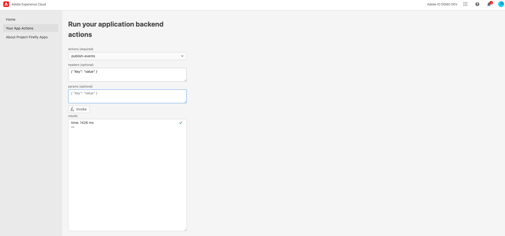
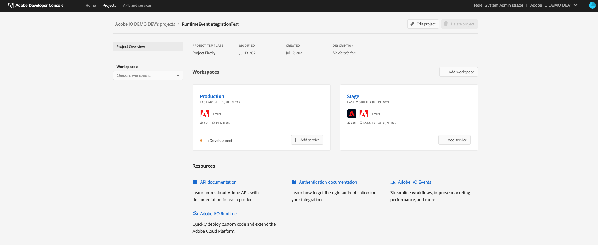
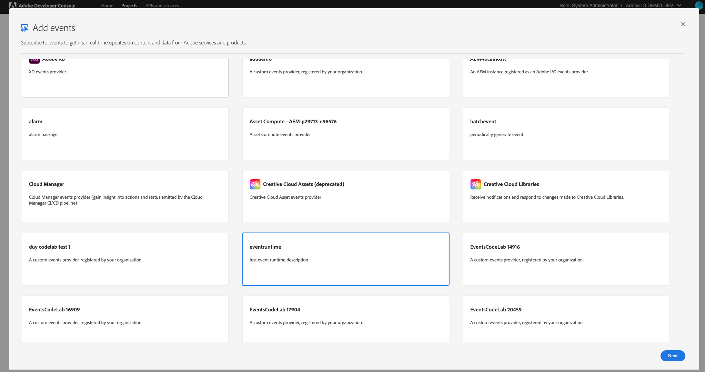
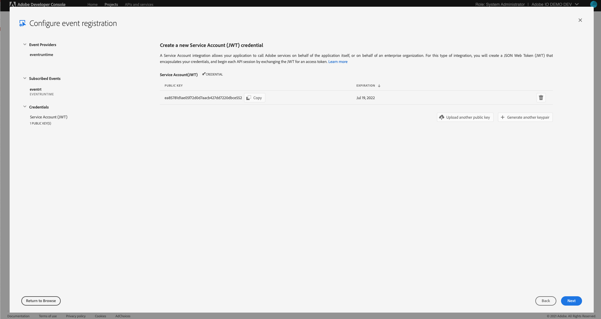

## Lesson 1: Step by Step Guide

### Initialize a Firefly app using template 
If you don't have a Firefly app, please follow [this](https://adobeio-codelabs-custom-events-adobedocs.project-helix.page/?src=/lessons/lesson1.html) to create one, make sure you have `publish-event`in the template and add `I/O management API`in console. After done, and run `aio app deploy` you should have seen this 


and here is the project I set up at adobe developer console 



### Event Registration

- Follow [this](https://adobeio-codelabs-custom-events-adobedocs.project-helix.page/?src=/lessons/lesson2.html) to register the event provider, in my case, while at the step:
```
aio event registration create 
``` 
It will show you a sample of JSON format, make sure you select `webhook` in my case, here is an example of .json file
```
{
    "name": "event-runtime-integration",
    "description": "test event runtime",
    "delivery_type": "WEBHOOK",
    "webhook_url": "https://io-webhook.herokuapp.com/webhook/testjie",
    "events_of_interest": [
        {
        "provider_id": "ccefc74d-9696-4b99-a799-f2d34a4189cd",
        "event_code": "eventrt"
        }
    ]
}
```

- After finish the steps above, you should be able to see in your terminal that you successfully create register the event, and you will also see it at adobe developer console under the left bottom corner `event` your registration provider `eventrt` will show up there



- Subscribing to the "eventrt" event type


- Generate the JWT service account credentials key pair


- On the registration details page provide name and select the runtime user action created to setup event registration, select the user action from the dropdown of Runtime Actions, as we create the event consumer using generic/index.js, so we will choose this one


Now, clicking on the "save configured events", then if we go to dev console we see this new "eventrt" - with new sync event handler as webhook registered successfully


Now, if user goes to his aio-cli and do "aio runtime list", he can see the below entities created as part of the new flow of event registration


Next lesson: [Verify the result](lesson2.md)
